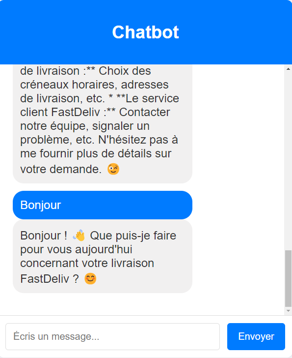

# Gemini ChatBot App

## Lancement du projet

### Prérequis

Logiiels nécéssaires au projet :

- [Node.js](https://nodejs.org/)
- [npm](https://www.npmjs.com/)

### Installation

1. Clonez le dépôt :
   
   ```bash
   git clone https://github.com/username/nom-du-projet.git
2. Placez vous dans le bon répertoire :
   
   ```bash
   cd nomDuProjet
3. Installez les dépendances :
   
   ```bash
   npm i
4. Lancez le projet :
   
   ```bash
   npm run dev

## Intégration de l'API Gemini
1. Création d'un compte Google Cloud :

Je me suis rendu sur Google Cloud, connecté avec mon compte afin d'autoriser les accès dévoleppeurs

2. Création d'un nouveau projet :

J'ai créé un nouveau projet en lui attribuant un nom, un type (application de bureau) et un email de contact (l'e-mail du comtpe Google).

3. Activation de l'API Gemini :
Dans la section "API et services" j'ai activé l'API.

4. Création d'identifiants et gestion des accès :
J'ai créé des identifiants et ai configuré les autorisations nécéssaires pour que le projet ait accès.

5. Téléchargement des bibliothèques clientes :
J'ai consulté la doc pour obtenir les bibliothèques clientes, et je les ai téléchargées.

6. Intégration de l'API dans le projet :
J'ai utilisé les identifiants créés pour configurer l'accès à l'API dans mon code et j'ai adapté le bloc de code que al doc donnait aux étapes du début.

7. Test de l'intégration :
Après tests des appels API, le chatbot répond correctement aux questions, sans restriction du scope ni contexte pour l'instant.


## Conception de l'interface utilisateur

1. Réflexion sur le style :
J'ai réflechi à quel template je voulais, quel style, quel design.

2. Recherche d'un exemple de template :
Une fois trouvé, j'ai cherché un template qui correspondait à ce que je cherchais.

3. Adapdtation du template :
J'ai ensuite adapté le template et modifié quelques éléments, ce qui donene le résultat suivant



## Personnalisation du Modèle IA

1. J'ai d'abord appliqué un contexte au modèle en suivant la règle R.A.C.A (Rôle, Action, Contexte, Attente). pour conditionner le modèle à répondre dans le contexte où il est (service client d'un service de livraison)
   
   ```bash
   Ton rôle est d\'aider les utilisateurs concernant le service de livraison FastDeliv. Si l\'utilisateur évoque un sujet qui ne concerne pas le service de livraison, informe-le que tu es exclusivement programmé pour répondre à des questions à ce sujet et reste toujours professionnel. Le contexte est que tu es un chatbot dédié au service client de FastDeliv, donc tes réponses doivent se limiter aux questions liées à ce service. Tes actions doivent se concentrer sur la gestion des demandes et des questions spécifiques à FastDeliv, en veillant à fournir des réponses claires, précises et adaptées aux besoins des utilisateurs

2. J'ai ensuite ajouté des patternes dans un fichier JSON dans lequel une série de questions sont reliées à une réponse
   
## Élaboration de Prompts Avancés
Grâce au fichier json, le chatbot est spécialisé dans son contexte.

## Choix des technos
J'ai choisi Node.js pour le projet chatbot en raison de sa gestion efficace des requêtes. Utiliser JavaScript, le même langage de développement, simplifie le code et la maintenance. La large collection de modules via npm a facilité l'ajout de fonctionnalités nécessaires.
J'ai aussi intégré le système de vues EJS pour générer des pages dynamiques et améliorer l'expérience utilisateur avec des contenus adaptés.

## Méthodologie
Ma méthode pour le projet a été assez classique : j'ai principalement suivi les documents de référence et les cours pour me guider. Quand j'avais des questions ou des doutes, je n'hésitais pas à demander de l'aide à mon professeur. Cette approche m'a permis d'avancer à mon rythme tout en ayant un soutien disponible lorsque c'était nécessaire.